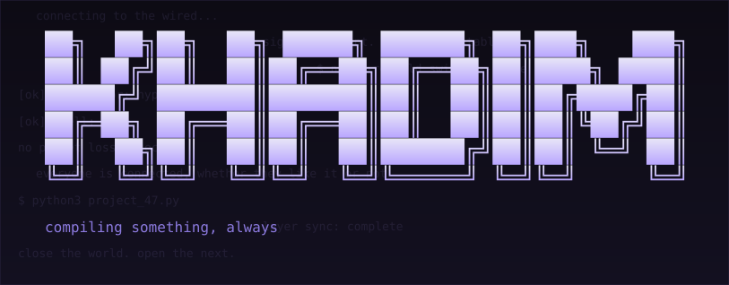
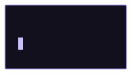

<div align="center">



<br/>



```
                     ●
                    /|\
                   / | \
                  *  |  *
                     |
                    /|\
```

### _no matter where you go, everyone's connected._

</div>

---

### 🕸️ ORIGIN

Somewhere between a terminal and a lecture hall, a student started rebuilding
his own machine from scratch — system, window manager, shell, editor, all of it —
until the OS felt less like a tool and more like a room he lived in.
He's still in there. Still rebuilding. Still not fully connected.

---

### 📋 FILE — LAYER 07

| ATTRIBUTE | VALUE |
|---|---|
| Name | Khadim |
| Also known as | `khadimshiny2-beep` |
| Base of Operations | Dakar, Senegal |
| Current Form | LDIA student — Data & AI |
| Power | Debugging by staring at the wall in silence |
| Weakness | Off-by-one errors, dotfiles, 3 AM rabbit holes |
| Sidekick | A NixOS config that's never quite "done" |
| Catchphrase | "just one more rice before I sleep" |
| Signal | Serial Experiments Lain, quietly, in the background |

---

### 👁️ THINGS LURKING IN THE WIRED

| ENTITY | THREAT LEVEL | STATUS |
|---|---|---|
| The Merge Conflict | ▓▓▓▓░ | contained, barely |
| Segfault at 2 AM | ▓▓▓▓▓ | undefeated |
| The Unfinished Portfolio | ▓▓▓░░ | still rendering |
| Kali VM vs NixOS Host | ▓▓▓▓░ | uneasy truce |
| The Scholarship Deadline | ▓▓▓▓▓ | approaching |

---

### 🎒 WHAT'S IN THE LAIR

<p>

</p>

🐍 `python` ⚙️ `c` 🦀 `rust` 🗃️ `sql` 🌐 `html` 🎨 `css` ⚡ `javascript` 🐧 `linux` ❄️ `nixos` 📝 `neovim` 🐟 `fish` 🖥️ `tmux` 📓 `jupyter` 📦 `conda` 🐘 `postgresql`

```
🐍 python      → the everyday key, opens most doors
⚙️ c           → heavier, slower, doesn't break easily
🦀 rust        → the one still being forged, sharp when it's done
🗃️ sql         → how you talk to things that remember
🐘 postgres    → where the memories live
🌐 html/css/js → the surface, what the wired shows to outsiders
📓 jupyter     → the notebook where the experiments happen
📦 conda       → keeping the experiments from contaminating each other
🐧 linux       → not a tool, a whole way of living
❄️ nixos       → the lair itself, rebuilt from a single config file
📝 neovim/fish → how you move through it without touching a mouse
```

---

### 📡 MISSION LOG

```
[ACTIVE]      99 python projects — one small thing at a time
[ACTIVE]      cool-python-stuff — random small scripts and experiments, kept just because they're fun
[ONGOING]     cybersecurity detour — kali, parrotOS, tryhackme, htb
[QUIET]       portfolio site — live, but never finished
[LONG-TERM]   finding a way out — grad school, somewhere else
[LONG-TERM]   nix config — still building the lair
```

---

### 🚪 GET ME OUTSIDE OF THE WIRED

```
email     → khadimparsine2@gmail.com
portfolio → https://khadimshiny2-beep.github.io/portfolio-web/
linkedin  → https://www.linkedin.com/in/ahmadoul-khadim-gueye-b503743a6/
```

---

<div align="center">

```
┌───────────────────────────────────────┐
│  close the world.                      │
│  open the next.                        │
└───────────────────────────────────────┘
```

<sub>thanks for stopping by the wired.</sub>

</div>
